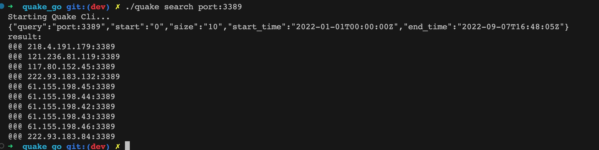

<!--
 * @Author: ph4nt0mer
 * @Date: 2022-09-01 18:39:52
 * @LastEditors: rootphantomer
 * @LastEditTime: 2022-09-14 11:05:21
 * @FilePath: /quake_go/README.md
 * @Description:
 *
 * Copyright (c) 2022 by ph4nt0mer, All Rights Reserved.
-->

# Quake_go

Quake Command-Line Application With Golang

## rust 版本

rust 项目代码 移步这里——https://github.com/360quake/quake_rs/

## 安装

1. 直接下载即可使用
2. 或者本地编译：

   ```bash
   // 安装golang后编译
   go  build .
   ```

## 更新日志

- 2022-09-14 v1.6:

  - 新增主机数据接口，增加主机数据实时查询功能(example:./quake host 'service:http' -st 0 -sz 20)
  - 优化命令行提示和代码逻辑

- 2022-09-10 v1.5:

  - 替换解析的 response 的 json 由 struct 变为 map，方便可以自定义需要返回的结果
  - 支持-fe 多个可选字段，单独输出结果集

- 2022-09-07 v1.4:

  - 替换 hflag 来解析命令行参数，使参数拓展开发更简单
  - 更新 query 接口为 search
  - 支持 -fq 参数，可以使用载入一个逐行有搜索语法的 txt 文本，然后统一结果输出 ip:port

- 2022-09-07 v1.3:

  - 支持-ic,-s,-e(ignore_cache,start_time,end_time)参数传入,start_time 初始化是当年年初 01-01，end_time 默认初始化是 now()
  - 优化发包的结构体解析

- 2022-09-06 v1.2:

  - 默认输出格式为 ip:port(见下图)
  - 新增-t=body 可以输出 body 信息

- 2022-09-06 v1.1:

  - 简化参数传参格式
  - 将 token 固化在当前目录

- 2022-09-01 v1.0:

  - 新增 info 接口功能
  - 新增 service 接口功能

## 使用

```bash
Starting Quake Cli...
usage: quake [option] [-e,end_time time=2022-09-07 16:47:32] [-fe,field string] [-h,help bool] [-ic,ignore_cache bool=false] [-qt,query_txt string] [-sz,size string=10] [-st,start string=0] [-s,start_time time=2022-01-01]

positional options:
       option          [string]                    init,info,search

options:
   -e, --end_time      [time=2022-09-07 16:47:32]  -e time to end time flag
  -fe, --field         [string]                    -fe body to show body infomation
   -h, --help          [bool]                      show usage
  -ic, --ignore_cache  [bool=false]                -ic true or false,default false
  -qt, --query_txt     [string]                    -qt ./file.txt file to query search
  -sz, --size          [string=10]                 -sz to size number
  -st, --start         [string=0]                  -st to start number
   -s, --start_time    [time=2022-01-01]           -s time flag , default time is time.now.year
```

## 用例

```bash
1、 ./quake init <token>

2、./quake info

3、 ./quake search port:8080 -st 0 -sz 10

```


