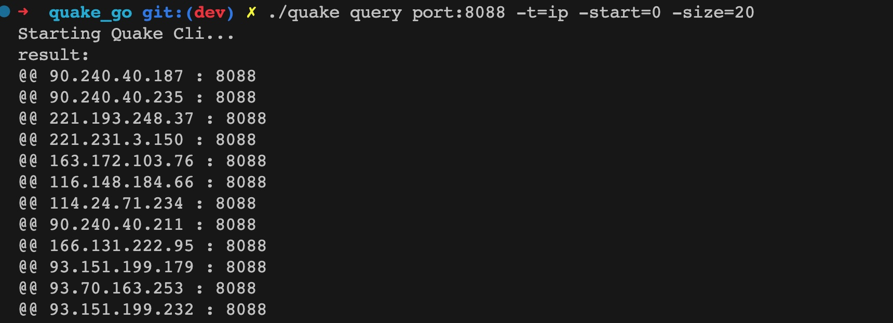

<!--
 * @Author: ph4nt0mer
 * @Date: 2022-09-01 18:39:52
 * @LastEditors: rootphantomer
 * @LastEditTime: 2022-09-07 12:42:01
 * @FilePath: /quake_go/README.md
 * @Description:
 *
 * Copyright (c) 2022 by ph4nt0mer, All Rights Reserved.
-->

# Quake_go

Quake Command-Line Application With Golang

## rust 版本

rust 项目代码 移步这里——https://github.com/360quake/quake_rs/

## 安装

1. 直接下载即可使用
2. 或者本地编译：

   ```bash
   // 安装golang后编译
   go  build .
   ```

## 更新日志

- 2022-09-07 v1.4:

  - 替换 hflg 来解析命令行参数，使参数拓展开发更简单

- 2022-09-07 v1.3:

  - 支持-ic,-s,-e(ignore_cache,start_time,end_time)参数传入
  - 优化发包的结构体解析

- 2022-09-06 v1.2:

  - 默认输出格式为 ip:port(见下图)
  - 新增-t=body 可以输出 body 信息

- 2022-09-06 v1.1:

  - 简化参数传参格式
  - 将 token 固化在当前目录

- 2022-09-01 v1.0:

  - 新增 info 接口功能
  - 新增 service 接口功能

## 使用

```bash
Starting Quake Cli...
example:
./quake init <token>
./quake info
./quake query port:443
./quake query port:443 -start=0 -size=20
```

## 案例


